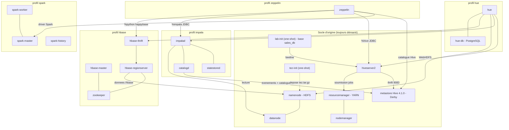

# Atelier HDFS + Hive — MapReduce / Tez / LLAP + Spark, Zeppelin, HBase, Impala, Hue

Environnement Docker Compose prêt à l'emploi pour dérouler l'atelier
« Manipulations HDFS + Hive et benchmark moteurs Hive » : chargement HDFS,
table Hive externe, puis comparaison des moteurs d'exécution **MapReduce**,
**Tez** (par défaut) et, en bonus, **LLAP**.

Le projet est complété par les composants de l'écosystème, tous branchés sur le
**même HDFS** et le **même metastore Hive** : une table créée dans un outil est
visible dans tous les autres.

- **Apache Spark** (cluster standalone + History Server) ;
- **Apache Zeppelin**, avec le notebook du **TP N1** préinstallé ;
- **Apache HBase** ;
- **Apache Impala** ;
- **Hue**.

Point de départ : [crystalloide/hadoop-tez-docker](https://github.com/crystalloide/hadoop-tez-docker)
(cluster Hadoop 3.4.2 + Tez 0.10.5), simplifié à 1 nœud par rôle et complété
par la couche Hive (basée sur l'image officielle `apache/hive:4.1.0`, qui
embarque Hadoop 3.4.1 et Tez 0.10.5 — versions quasi identiques à celles du
cluster, donc aucun souci de compatibilité de protocole — avec un petit
correctif local, voir [Notes techniques](#notes-techniques)).

## Composants et versions

Les versions du projet d'origine sont **inchangées**. Chaque composant ajouté a
été choisi pour être compatible avec elles. Le détail des choix est dans
[Notes techniques](#pourquoi-ces-versions-pour-les-composants-ajoutés).

| Composant | Version | Image | Profil | Point de compatibilité avec le socle |
|---|---|---|---|---|
| Hadoop (HDFS, YARN) | **3.4.2** | build `./hadoop` (base `apache/hadoop:3.4.2`) | *(socle)* | — |
| Tez | **0.10.5** | idem | *(socle)* | — |
| Hive (metastore, HiveServer2) | **4.1.0** | build `./hive` (base `apache/hive:4.1.0`) | *(socle)* | — |
| JDK | **17** | — | — | utilisé par tous les composants ajoutés |
| ZooKeeper | **3.8.4** | `zookeeper:3.8.4` | `llap`, `hbase` | partagé LLAP / HBase |
| Spark | **4.0.4** (Scala 2.13, Python 3.10) | build `spark/Dockerfile` (base `apache/spark:4.0.4-scala2.13-java17-python3-ubuntu`) | `spark` | client metastore Hive 4.0.1 isolé : le client Hive 2.3 intégré à Spark ne sait pas parler à un metastore Hive 4.x |
| Zeppelin | **0.12.1** | build `spark/Dockerfile` (cible `zeppelin`) | `zeppelin` | supporte officiellement Spark 4.0 ; pilote JDBC Hive **4.1.0** |
| HBase | **2.6.7** (binaire hadoop3) | build `./hbase` | `hbase` | JDK 17 et Hadoop 3.4 officiellement supportés |
| Impala | **4.5.2** | `apache/impala:4.5.2-*` | `impala` | metastore Hive 4 (Thrift), HDFS 3.x |
| Hue | **4.11.0** | `gethue/hue:4.11.0` (+ PostgreSQL 15) | `hue` | HiveServer2 4.x, Impala, WebHDFS, HBase Thrift v1 |

## Architecture



Les profils Docker Compose permettent de ne démarrer que ce dont la séance a
besoin. Le socle seul correspond à l'atelier d'origine, plus le chargement
automatique de la base de démonstration `sales_db` (service `lab-init`).

## Prérequis 1

- Docker Desktop récent (ou Docker Engine 23+ avec Compose v2 et BuildKit), sur une machine
  **x86_64 / amd64** (le socle d'origine télécharge un JDK x64, et les images
  Impala et Hue ne sont publiées qu'en amd64).
- Mémoire allouée à Docker :

  | Démarrage | RAM conseillée |
  |---|---|
  | socle seul (atelier d'origine) | 6 Go (8 Go avec le bonus LLAP) |
  | socle + `zeppelin` (Spark + Zeppelin, TP N1) | 10 Go |
  | `full` (tous les composants) | **16 Go** |

- Espace disque : ~25 Go libres pour le profil `full` (images + couches de build).
- Premier build `full` : 15 à 30 minutes selon la connexion. Les binaires sont
  téléchargés depuis Docker Hub, les miroirs Apache et Maven Central.
- Ports libres sur l'hôte : `9870`, `8088`, `10000`, `10002` pour le socle,
  plus ceux des profils activés :

  | Profil | Ports |
  |---|---|
  | `llap` | `2181`, `10001`, `10012` |
  | `spark` | `8080`, `8081`, `18080` |
  | `zeppelin` | `8082`, `4040` (+ ceux de `spark`) |
  | `hbase` | `2181`, `16010`, `16030`, `9090`, `9095` |
  | `impala` | `21050`, `25000`, `25010`, `25020` |
  | `hue` | `8888` |

## Pré-requis 2 :

On récupère le projet en local :

```bash
cd ~
sudo rm -Rf BD540
git clone https://github.com/crystalloide/BD540
cd BD540
```

## Démarrage rapide

### Socle seul (atelier d'origine)

```bash
docker compose up -d --build
```

### Écosystème complet

```bash
docker compose --profile full up -d --build
```

### À la carte

Les profils se combinent librement :

| Commande | Démarre |
|---|---|
| `docker compose up -d --build` | socle : HDFS, YARN, Tez, Hive (+ `lab-init`) |
| `docker compose --profile zeppelin up -d --build` | socle + Spark + Zeppelin → **TP N1** |
| `docker compose --profile spark up -d --build` | socle + Spark |
| `docker compose --profile hbase up -d --build` | socle + ZooKeeper + HBase |
| `docker compose --profile impala up -d` | socle + Impala |
| `docker compose --profile hue --profile impala --profile hbase up -d --build` | socle + Hue avec Impala et HBase |
| `docker compose --profile full up -d --build` | tout sauf le bonus LLAP |
| `docker compose --profile llap up -d` | bonus LLAP d'origine |

> Hue démarre même si Impala ou HBase ne tournent pas : seuls les éditeurs
> correspondants afficheront une erreur de connexion.

Suivez l'initialisation :

```bash
docker compose logs tez-init
```

Vous devez voir `Tez-Init : TERMINÉ avec succès !`. Puis attendez que tout
soit "healthy" :

```bash
docker compose --profile full ps
```

`hiveserver2` peut prendre 1 à 2 minutes à démarrer (initialisation du
schéma Derby). Une fois `healthy`, l'environnement est prêt. Les services
one-shot `lab-init` (données de démo) et `hbase-init` (table HBase de démo)
s'arrêtent d'eux-mêmes une fois leur travail terminé (`Exited (0)`) : c'est
normal.

### Vérifier l'installation

```bash
docker exec namenode hdfs dfs -ls /apps/tez/
docker exec namenode hdfs getconf -confKey dfs.replication
docker exec resourcemanager yarn node -list
```

Vérification automatique de tous les composants démarrés (les profils non
activés sont ignorés), depuis l'hôte :

```bash
bash scripts/check_stack.sh
```

Chaque ligne doit afficher `[ OK ]`. Comptez 3 à 5 minutes après le
démarrage du profil `full` avant de lancer la vérification.

### Interfaces web

| Service | URL | Profil |
|---|---|---|
| NameNode (HDFS) | http://localhost:9870 | socle |
| ResourceManager (YARN) | http://localhost:8088 | socle |
| HiveServer2 (web UI) | http://localhost:10002 | socle |
| Spark Master | http://localhost:8080 | spark |
| Spark Worker | http://localhost:8081 | spark |
| Spark History Server | http://localhost:18080 | spark |
| **Zeppelin** | **http://localhost:8082** | zeppelin |
| Driver Spark lancé par Zeppelin | http://localhost:4040 | zeppelin |
| HBase Master | http://localhost:16010 | hbase |
| HBase RegionServer | http://localhost:16030 | hbase |
| HBase Thrift (UI) | http://localhost:9095 | hbase |
| Impala — impalad | http://localhost:25000 | impala |
| Impala — statestore | http://localhost:25010 | impala |
| Impala — catalog | http://localhost:25020 | impala |
| **Hue** | **http://localhost:8888** | hue |

Les raccourcis correspondants sont dans le dossier `url/`.

## Déroulé de l'atelier

### Étape 1 — Chargement des données sur HDFS

```bash
docker exec namenode bash /opt/scripts/01_prepare_hdfs.sh
```

(`data/clients.csv` est déjà fourni — 20 clients de test — mais vous pouvez
le remplacer par le vôtre avant de lancer le script.)

### Étape 2 — Création de la table Hive externe

```bash
docker exec -it hiveserver2 beeline -u 'jdbc:hive2://localhost:10000/default' -f /opt/scripts/02_create_table.hql
```

### Étape 3 — Requête et temps de traitement

```bash
docker exec -it hiveserver2 beeline -u 'jdbc:hive2://localhost:10000/default' -f /opt/scripts/03_query_villes.hql
```

### Étape 4 — Comparaison des moteurs

Manuellement en session Beeline :

```bash
docker exec -it hiveserver2 beeline -u 'jdbc:hive2://localhost:10000/default'
```
```sql
SET hive.execution.engine=mr;
SELECT ville, COUNT(*) AS nb_clients FROM clients GROUP BY ville;

SET hive.execution.engine=tez;
SELECT ville, COUNT(*) AS nb_clients FROM clients GROUP BY ville;
```

Ou automatiquement, depuis l'hôte, avec chronométrage :

```bash
bash scripts/benchmark_engines.sh
```

Si les profils `impala` et/ou `spark` sont démarrés, le script ajoute en bonus
la même requête exécutée par **Impala** (démons toujours actifs, sans YARN) et
par **Spark SQL**.

Sur un jeu de données aussi petit, l'essentiel de l'écart vient du
**démarrage** du moteur (allocation de conteneurs YARN, JVM) : MapReduce
lance un ApplicationMaster puis des tâches map/reduce séquentielles,
pendant que Tez réutilise un DAG et évite les écritures disque
intermédiaires. C'est exactement l'écart que l'atelier vous fait observer
(de l'ordre de 30 à 60 s en MapReduce contre 5 à 10 s en Tez — les valeurs
réelles dépendent de la machine).

### Étape 5 — Analyse

Éléments de restitution attendus (cf. corrigé de l'atelier) : MapReduce
lent mais robuste pour du batch planifié ; Tez plus rapide grâce à son DAG
et à l'absence d'écritures intermédiaires ; LLAP quasi instantané mais plus
complexe à opérer en production.

## Bonus LLAP (optionnel)

L'énoncé indique LLAP comme optionnel (« si disponible ») — c'est aussi le
moteur le plus lourd à faire tourner correctement. Ce dépôt fournit un
profil dédié, repris de l'environnement Docker **officiel du projet Apache
Hive** (Zookeeper + AM Tez autonome + daemon LLAP), plutôt qu'une
intégration LLAP-sur-YARN maison — cette dernière demande normalement
Slider ou le service YARN natif, largement hors du cadre d'un lab. Le prix
à payer : ce mode tourne **sans YARN**, avec un HiveServer2 dédié sur un
port séparé.

```bash
docker compose --profile llap up -d
```

Puis, dans une session sur le **second** HiveServer2 (port `10001`, table
`clients` partagée via le même metastore) :

```bash
docker exec -it hiveserver2-llap beeline -u 'jdbc:hive2://localhost:10000/default'
```
```sql
SET hive.execution.engine=tez;
SET hive.llap.execution.mode=all;
SELECT ville, COUNT(*) AS nb_clients FROM clients GROUP BY ville;
```

`scripts/benchmark_engines.sh` détecte automatiquement `hiveserver2-llap`
s'il tourne et ajoute la mesure LLAP à la comparaison.

**En cas de problème avec LLAP :** retirer simplement `--profile llap` : l'atelier reste complet avec MapReduce et Tez, qui sont le cœur du sujet.

Le conteneur `zookeeper` est partagé avec le profil `hbase` : démarrer les deux
profils ensemble ne crée qu'un seul ZooKeeper.

## Composants ajoutés — utilisation

Toutes les commandes ci-dessous se lancent depuis l'hôte. Les composants
partagent :

- le HDFS `hdfs://namenode:8020` ;
- le metastore Hive `thrift://metastore:9083` ;
- la base de démonstration **`sales_db.transactions`** (150 ventes,
  `data/transactions.csv`), créée au démarrage par le service `lab-init`. Sa
  colonne `customer_id` correspond à `id_client` de la table `clients` de
  l'atelier.

### Zeppelin — http://localhost:8082

Profil `zeppelin` (Spark est démarré avec lui). Deux notebooks sont
préinstallés :

| Notebook | Contenu |
|---|---|
| **TP / TP_N1** | le TP N1 fourni (Hive, `%sh` + HDFS, PySpark, Spark SQL), adapté à cet atelier |
| **Atelier / Demo ecosysteme** | la même table interrogée par HDFS, Hive, Spark, Impala et HBase : vérification de bout en bout |

Le TP N1 n'a subi que des retouches mineures :

- l'adresse du NameNode `hdfs://namenode:9000` de la version d'origine devient
  `hdfs://namenode:8020`, le port de ce cluster ;
- la coquille `logjlogs` d'une cellule de texte est corrigée en `log4jlogs` ;
- un paragraphe d'introduction est ajouté, et le rappel de syntaxe
  `CREATE TABLE` est affiché comme bloc de code.

La version corrigée est aussi fournie au format Jupyter dans
`notebooks/TP_N1.ipynb` (seules les deux premières retouches), importable dans
Zeppelin via *Import note*.

Interpréteurs préconfigurés (`zeppelin/conf/interpreter.json`) :

| Interpréteur | Cible |
|---|---|
| `%spark`, `%spark.pyspark`, `%spark.sql` | Spark 4.0.4, `spark://spark-master:7077`, catalogue Hive partagé (1 Go de driver, 2 executors de 1 cœur / 1 Go) |
| `%hive` | HiveServer2 : `jdbc:hive2://hiveserver2:10000/default` (pilote JDBC Hive 4.1.0) |
| `%impala` | Impala : `jdbc:hive2://impalad:21050/default;auth=noSasl` |
| `%sh` | shell du conteneur, avec les clients `hdfs`, `yarn` (Hadoop 3.4.2), `spark-submit`, `pyspark` |
| `%python` | Python 3.10, avec `happybase` (client HBase via Thrift) |
| `%md` | Markdown |

Le premier paragraphe Spark démarre l'application Spark, ce qui prend 30 à
60 s. Elle reste ensuite active (visible sur http://localhost:8080) jusqu'au
redémarrage de l'interpréteur.

Les notebooks sont conservés dans le volume Docker `zeppelin_notebook`. Un
`docker compose down -v` le réinitialise avec les notebooks d'origine.

### Spark — http://localhost:8080

Profil `spark`. Le cluster standalone compte 1 master et 1 worker de 4 cœurs et
3 Go. Chaque application prend au plus 2 cœurs, pour que Zeppelin et une
démonstration en ligne de commande puissent tourner ensemble.

```bash
# Shell PySpark interactif sur le cluster, avec le catalogue Hive partagé
docker exec -it spark-master pyspark
>>> spark.sql("SELECT city, SUM(amount) FROM sales_db.transactions GROUP BY city").show()

# Job batch
docker exec spark-master spark-submit /opt/scripts/spark/smoke_test.py
```

Les applications terminées restent consultables dans le Spark History Server
(http://localhost:18080). Leurs journaux d'événements sont dans
`hdfs:///spark-logs`.

> Les scripts de vérification et les notebooks passent par `pyspark` et
> `spark-submit`. Préférez ces points d'entrée à la CLI `spark-sql`, qui
> s'appuie en partie sur le Hive 2.3 intégré à Spark alors que le catalogue est
> servi ici par un client metastore Hive 4.0.1 isolé (voir
> [Notes techniques](#pourquoi-ces-versions-pour-les-composants-ajoutés)).

### HBase — http://localhost:16010

Profil `hbase`. Le service one-shot `hbase-init` crée la table de démonstration
`clients_hbase`, avec 20 lignes et les familles `infos` et `stats`.

```bash
docker exec -it hbase-master hbase shell
hbase:001:0> list
hbase:002:0> scan 'clients_hbase', {LIMIT => 3}
hbase:003:0> get 'clients_hbase', 'C001'
```

Deux autres accès sont disponibles :

- Hue, menu **HBase** ;
- Zeppelin, `%python` avec `happybase` (serveur Thrift `hbase-thrift:9090`).
  Voir le notebook *Demo ecosysteme*.

### Impala — http://localhost:25000

Profil `impala`. Impala lit les tables du metastore Hive et les fichiers HDFS,
sans passer par YARN. Les bases et tables créées par Hive, Spark ou Hue
apparaissent automatiquement dans Impala en quelques secondes : `catalogd`
suit les événements du metastore.

Après un ajout de fichiers directement dans HDFS, rechargez la table :

```sql
INVALIDATE METADATA sales_db.transactions;   -- ou REFRESH sales_db.transactions;
```

Trois clients sont possibles :

- Hue, éditeur **Impala** ;
- Zeppelin, `%impala` ;
- beeline, depuis le conteneur HiveServer2 :

```bash
docker exec -it hiveserver2 beeline -u 'jdbc:hive2://impalad:21050/default;auth=noSasl'
```

`scripts/benchmark_engines.sh` ajoute automatiquement une mesure Impala et une
mesure Spark SQL à la comparaison MapReduce / Tez quand ces services tournent.

### Hue — http://localhost:8888

Profil `hue`. À la **première connexion**, Hue demande de créer un compte, par
exemple `admin` / `admin`. Ce premier compte devient administrateur.

| Menu Hue | Branché sur |
|---|---|
| Éditeur **Hive** | HiveServer2 (`hiveserver2:10000`) |
| Éditeur **Impala** | `impalad:21050` |
| **Fichiers** | HDFS via WebHDFS (`namenode:9870`) |
| **Tables** | metastore, via HiveServer2 |
| **Jobs** | YARN ResourceManager |
| **HBase** | `hbase-thrift:9090` |

Les comptes, l'historique et les requêtes sauvegardées de Hue sont stockés dans
le PostgreSQL `hue-db`, sur le volume `hue_db_data`.

## Nettoyage

```bash
docker compose --profile full --profile llap down -v
```

`-v` supprime aussi les volumes : notebooks Zeppelin modifiés et base Hue.
Sans `-v`, ils sont conservés pour la séance suivante.

## Dépannage

| Symptôme | Cause probable / solution |
|---|---|
| `docker compose ps` : `lab-init` ou `hbase-init` en `Exited (0)` | Normal : services one-shot terminés avec succès. |
| `lab-init` en `Exited (1)` | HiveServer2 n'a pas répondu à temps. Relancer : `docker compose up -d lab-init`, puis `docker compose logs lab-init`. |
| Premier paragraphe Spark de Zeppelin très long | Démarrage de l'application Spark (30 à 60 s). Suivi dans http://localhost:8080. Si l'application reste en *WAITING* : un autre programme Spark occupe les cœurs du worker, arrêtez-le. |
| Zeppelin : `Interpreter process is not running` | *Settings > Interpreter > spark > restart*. Journaux : `docker exec zeppelin ls /opt/zeppelin/logs`. |
| Impala ne voit pas une table créée dans Hive | Attendre quelques secondes (synchronisation par événements), sinon `INVALIDATE METADATA base.table;`. |
| `catalogd` s'arrête au démarrage (`Events processor cannot start`) | Le metastore n'a pas relu `hive-conf/hive-site.xml` (`hive.metastore.dml.events=true`) : `docker compose restart metastore`, puis `docker compose --profile impala up -d`. |
| Hue : erreur sur l'éditeur Impala ou le menu HBase | Le profil correspondant n'est pas démarré (`--profile impala` / `--profile hbase`). |
| HBase : `PleaseHoldException: Master is initializing` | Le master attend le RegionServer : patienter 1 à 2 minutes. |
| Build : `404` sur un téléchargement Apache | Les Dockerfiles se replient automatiquement sur `archive.apache.org`. Si les deux échouent, relancer le build (miroir temporairement indisponible). |
| Mémoire insuffisante (conteneurs tués, code 137) | Augmenter la RAM de Docker (16 Go pour `full`) ou ne démarrer que les profils utiles. |

## Notes techniques

- **`/tmp` lui-même doit être ouvert en écriture (`1777`), pas seulement
  ses sous-dossiers.** Le moteur MapReduce classique
  (`hive.execution.engine=mr`) crée son répertoire de staging directement
  sous `/tmp` (`/tmp/hadoop-yarn/staging/hive/.staging`) au premier job
  soumis ; `/tmp` était resté à sa permission HDFS par défaut (`755`,
  propriétaire `hadoop`), ce qui bloquait l'utilisateur `hive`
  (`Permission denied: user=hive, access=WRITE, inode="/tmp"`). Corrigé en
  ouvrant `/tmp` lui-même dans `init-tez.sh` — même famille de bug que
  `/user/hive` plus haut : chmoder les sous-dossiers qu'on crée ne suffit
  pas si le dossier parent, lui, reste fermé.
- **`/opt/tez/lib/` embarque aussi `commons-collections-3.2.2.jar`.** Du
  code interne à `hive-exec-4.1.0.jar` (`Operator.initializeChildren`)
  utilise encore l'ancienne bibliothèque `commons-collections`
  (`org.apache.commons.collections.CollectionUtils`, pas
  `commons-collections4`), que Hadoop 3.4.x n'embarque plus par défaut —
  chaque tâche Tez qui initialise un opérateur plantait avec
  `NoClassDefFoundError` sans ce jar. Il est placé dans `/opt/tez/lib/`
  car ce chemin fait déjà partie de `yarn.application.classpath`
  (`hadoop/config`, dupliqué dans `hive-conf/yarn-site.xml`), donc
  disponible pour l'AM et toutes les tâches sans configuration par job. Si
  une erreur `NoClassDefFoundError` similaire réapparaît pour une autre
  classe, la même recette s'applique : trouver le jar Maven correspondant
  et le déposer au même endroit.
- **Les conteneurs Hadoop tournent en JDK 17, pas en JDK 8 (par défaut de
  l'image `apache/hadoop:3.4.2`).** Deux problèmes distincts avec l'image
  officielle `apache/hive` (4.1.0) : (1) elle ajoute automatiquement des
  options JVM `--add-opens=...` en soumettant un job Tez, qu'un JDK 8 ne
  reconnaît pas ("Unrecognized option") ; (2) `hive-exec-4.1.0.jar` est
  compilé pour cibler le bytecode Java 17 (class file version 61) — un
  JDK 11, qui accepte pourtant la syntaxe `--add-opens` (JDK9+), ne peut
  toujours pas charger ces classes (`UnsupportedClassVersionError`). Les
  deux se règlent en passant Hadoop sur JDK 17. Bug connu et non réglable
  côté configuration Hive/Tez, voir
  [HIVE-29015](https://issues.apache.org/jira/browse/HIVE-29015), où le
  rapporteur confirme avoir testé exactement cette combinaison (Hadoop
  3.4.1 sous JDK 17) avec succès.
  **Installé par téléchargement direct d'une archive Eclipse Temurin
  (Adoptium), pas via `yum`** : cette image est basée sur CentOS 7, dont
  les dépôts `os`/`updates` pour ce point de version précis (7.6.1810) ont
  disparu des miroirs publics depuis la fin de vie de CentOS 7 (juin
  2024) — `yum install` y échoue désormais quasiment à chaque fois. Voir
  `hadoop/Dockerfile`.
- **`/user/hive` doit être accessible en écriture à l'utilisateur `hive`.**
  Au premier lancement d'une session Tez, Hive met en cache un jar de
  session sous `/user/<utilisateur>` sur HDFS — ici `/user/hive`, qui
  n'appartenait qu'à `hadoop` (celui qui exécute `init-tez.sh`), pas à
  `hive` (celui qui fait tourner HiveServer2) :
  `Permission denied: user=hive, access=WRITE`. Corrigé dans
  `hadoop/init-tez.sh`, qui ouvre `/user/hive` en écriture pour tout le
  monde (`chmod -R 1777`).
  Ce répertoire est **volontairement laissé sur HDFS**, pas redirigé vers
  un chemin local (`hive.user.install.directory`) comme le fait le
  quickstart officiel Apache Hive — une piste explorée puis abandonnée ici,
  documentée directement dans `hive-conf/hive-site.xml` : ce raccourci ne
  fonctionne que pour un Hive en mode local/mono-processus (leur
  quickstart par défaut), pas pour un vrai cluster YARN multi-conteneurs
  comme celui-ci, où le NodeManager qui "localise" ce jar pour lancer l'AM
  Tez est un conteneur différent de `hiveserver2` et ne voit donc aucun
  chemin local à ce dernier.
- **`hive/Dockerfile` ajoute `findutils` par-dessus `apache/hive:4.1.0`.**
  Cette image officielle (base `eclipse-temurin ubi9-minimal`) n'installe
  pas `find`, alors que son propre `entrypoint.sh` s'en sert pour appliquer
  `HIVE_CUSTOM_CONF_DIR` — le mécanisme qui pointe Hive vers notre cluster
  HDFS/YARN/Tez. Sans ce correctif, `find` échoue silencieusement (le
  script continue sans erreur bloquante) et **toute** la configuration de
  `hive-conf/` est ignorée : Hive tombe alors sur ses réglages par défaut,
  déconnectés du cluster. `metastore`, `hiveserver2`, `tezam`, `llapdaemon`
  et `hiveserver2-llap` utilisent tous cette image corrigée.
- **Pas de volume nommé pour le Derby du metastore.** Un volume Docker
  nommé fraîchement créé appartient à `root` par défaut, alors que le
  processus Hive tourne avec un utilisateur non-root (`hive`, uid 1000) :
  Derby ne peut alors plus créer sa base au premier démarrage
  (`Failed to create database`). Comme la persistance entre sessions
  n'est de toute façon pas nécessaire pour cet atelier (on repart d'un état
  propre à chaque fois avec `docker compose down -v`), le plus sûr est de
  ne pas monter de volume ici : la base Derby vit dans la couche writable
  du conteneur `metastore`, avec les bonnes permissions héritées de l'image.
- **Hive 4.1.0** a été choisi (plutôt que 4.0.x ou 4.2.x) car c'est la
  version dont le couple Hadoop/Tez annoncé par le projet Apache Hive
  (Hadoop 3.4.1 / Tez 0.10.5) colle le mieux à la version du cluster
  (Hadoop 3.4.2 / Tez 0.10.5) — Tez identique, Hadoop quasi identique.
- **`hive-conf/mapred-site.xml` met `mapreduce.framework.name=yarn`**
  (classique), volontairement différent du `yarn-tez` utilisé sur les
  conteneurs Hadoop bruts (`hadoop/config`, hérité du dépôt de référence
  pour lancer un `hadoop jar ... wordcount` directement accéléré par Tez).
  Si Hive héritait de `yarn-tez`, `SET hive.execution.engine=mr;` serait
  silencieusement réexécuté par Tez, et l'atelier ne pourrait plus montrer
  d'écart entre les deux moteurs.
- Le métastore utilise Derby **embarqué**, mais dans son propre conteneur
  dédié : `hiveserver2` (et `hiveserver2-llap`) s'y connectent uniquement
  en Thrift, jamais en direct — ce qui évite la limitation Derby
  « un seul processus à la fois » tout en gardant l'environnement simple
  (pas de Postgres à faire tourner ni de driver JDBC à télécharger).

### Pourquoi ces versions pour les composants ajoutés

- **Spark 4.0.4 et non Spark 3.x : le metastore Hive 4.1.0 a supprimé l'appel
  Thrift `get_table`.** Le client Hive 2.3 intégré à tous les Spark 3.x (et à
  Spark 4 par défaut) l'utilise encore. Avec ce metastore, toute lecture du
  catalogue échoue sur `Invalid method name: 'get_table'`. Ce n'est pas une
  hypothèse : la comparaison des fichiers `hive_metastore.thrift` de Hive 2.3 et
  4.1.0 montre la suppression de `get_table`, de `get_table_objects_by_name` et
  des API d'index.

  Spark 4.0 sait charger un **client metastore Hive 4.0** dans un class loader
  isolé (SPARK-45265). On embarque donc les jars de Hive 4.0.1, copiés depuis
  l'image officielle `apache/hive:4.0.1`, et on les active dans
  `spark/conf/spark-defaults.conf` :
  `spark.sql.hive.metastore.version=4.0.1`,
  `spark.sql.hive.metastore.jars=path`. Tous les appels Thrift du client 4.0.1
  existent dans le metastore 4.1.0 (vérifié sur les fichiers `.thrift` : aucune
  méthode retirée entre les deux).

  Spark 4.1 supporterait directement un client 4.1.0, mais Zeppelin 0.12.1 ne
  supporte pas encore Spark 4.1 : Spark 4.0.4 est la dernière version compatible
  avec les deux.

- **Zeppelin 0.12.1** supporte officiellement Spark 4.0 (ZEPPELIN-6086 ; testé
  par sa CI en Scala 2.13 sur JDK 17). L'image Zeppelin est construite *sur*
  l'image Spark : même Spark, même Python (3.10) côté driver (Zeppelin) et côté
  executors (worker), ce qu'exige PySpark.

  Deux JDK cohabitent, aiguillés par `zeppelin/conf/zeppelin-env.sh` :
  - le **serveur** tourne en JDK 11, seul JDK validé par le projet pour le
    serveur ;
  - les **interpréteurs** tournent en JDK 17, indispensable pour Spark 4 et pour
    le pilote JDBC Hive 4.1.0, compilé pour Java 17.

  `USE_HADOOP=false` empêche `bin/zeppelin.sh` d'ajouter tout
  `hadoop classpath` au classpath du serveur.

- **`%sh` dans Zeppelin.** L'interpréteur shell a été **retiré des binaires
  officiels** de Zeppelin depuis la 0.11.1 (« [HOTFIX] Disable shell
  interpreter »). Le TP l'utilise : il est réinstallé depuis Maven Central
  (`org.apache.zeppelin:zeppelin-shell:0.12.1`) pendant le build. Seul `%sh` est
  déclaré : `%sh.terminal` dépend de pty4j, hébergé hors de Maven Central.
  Comme pour tout notebook, `%sh` exécute des commandes dans le conteneur : ne
  publiez pas le port 8082 en dehors du poste du stagiaire.

- **`%hive` / `%impala`** utilisent le pilote `hive-jdbc-4.1.0-standalone`, de
  la même version que HiveServer2. Impala parle le même protocole
  HiveServer2 (`auth=noSasl`).

- **HBase 2.6.7.** La branche 2.6 est la première où JDK 17 est officiellement
  supporté (2.5.x : support préliminaire), et elle supporte Hadoop 3.4 depuis la
  2.6.2. Choix de configuration :
  - WAL `filesystem` plutôt qu'`asyncfs`, qui accède par réflexion aux classes
    internes du client HDFS ;
  - `dfs.replication=1`, car il n'y a qu'un DataNode ;
  - serveur Thrift **v1** en transport *buffered*, le seul format supporté par
    Hue.

  ZooKeeper est le même conteneur que celui du bonus LLAP. Sa liste de
  commandes « 4 lettres » autorisées est seulement élargie (`srvr`, `stat`,
  `mntr`) pour l'UI HBase.

- **Impala 4.5.2** (images officielles `apache/impala`). Deux contraintes
  viennent de ces images :
  - les noms de service `statestored` et `catalogd` sont codés en dur dans
    leur `ENTRYPOINT` ;
  - `catalogd` démarre avec `-hms_event_polling_interval_s=1`. Au démarrage, il
    vérifie que le metastore a `hive.metastore.dml.events=true` et **refuse de
    démarrer** sinon. Ce réglage a été ajouté à `hive-conf/hive-site.xml`, avec
    le `DbNotificationListener`, déjà présent dans l'image Hive 4.1.0, qui
    produit les événements. Bénéfice : synchronisation automatique Hive/Spark →
    Impala.

  Le client metastore d'Impala (CDP Hive 3.1.3000) utilise `get_table_req`, pas
  `get_table` : il est compatible avec le metastore 4.1.0.

  Limite connue : les statistiques de colonnes `TIMESTAMP` calculées par Hive 4
  ne sont pas relues par Impala 4.5.2 (IMPALA-15361, corrigé après la 4.5.2).
  Cela n'affecte que l'optimiseur, pas les résultats.

- **Hue 4.11.0**, dernière version publiée de Hue (les autres tags de l'image
  sont des builds quotidiens). Points de configuration :
  - `hue/hive-conf/hive-site.xml` reflète le HiveServer2 de l'atelier
    (`doAs=false`, authentification `NONE`) : Hue ne demande pas
    d'impersonation ;
  - `hive.metastore.uris` en est volontairement absent : Hue passe uniquement
    par HiveServer2. Son client Thrift direct du metastore est antérieur à
    Hive 4 ;
  - l'explorateur de fichiers utilise WebHDFS avec l'utilisateur proxy `hue`,
    autorisé dans `hadoop/config` (`hadoop.proxyuser.hue.*`).

- **Contrôle des permissions HDFS désactivé** (`dfs.permissions.enabled=false`
  dans `hadoop/config`). Chaque moteur écrit sous une identité différente :
  `hive`, `root` (Zeppelin, Spark, HBase), `impala`, l'utilisateur Hue. Sans ce
  réglage, une table créée par un moteur ne pourrait pas être alimentée ou
  supprimée par un autre, ce qui casserait l'intérêt pédagogique d'un catalogue
  partagé. Les `chmod` de `init-tez.sh` sont conservés.

- **Téléchargements Apache robustes.** `downloads.apache.org` et `dlcdn` ne
  conservent que la dernière version de chaque projet. Tous les téléchargements
  (Tez, HBase, Zeppelin) se replient automatiquement sur `archive.apache.org`.
  Le build reste ainsi reproductible après la sortie d'une version plus récente.

### Modifications apportées aux fichiers du projet d'origine

Les versions ne changent pas. Les seules retouches du socle sont additives :

| Fichier | Modification |
|---|---|
| `hadoop/config` | utilisateur proxy `hue` ; `dfs.permissions.enabled=false` ; WebHDFS explicitement activé |
| `hadoop/init-tez.sh` | création de `/spark-logs`, `/user/data` (TP N1) et `/hbase` |
| `hadoop/Dockerfile` | repli sur `archive.apache.org` pour Tez 0.10.5 |
| `hive-conf/hive-site.xml` | `hive.metastore.dml.events` + `DbNotificationListener` (Impala) |
| `hive-conf/core-site.xml` | utilisateur proxy `hue` (filet de sécurité) |
| `docker-compose.yml` | `zookeeper` partagé (profils `llap`, `hbase`, `full`) + nouveaux services |
| `scripts/benchmark_engines.sh` | mesures Impala et Spark SQL en bonus, si ces services tournent |

Nouveaux fichiers : `spark/`, `zeppelin/`, `hbase/`, `impala/`, `hue/`,
`notebooks/TP_N1.ipynb`, `data/transactions.csv`,
`scripts/00_demo_sales_db.hql`, `scripts/lab-init.sh`,
`scripts/check_stack.sh`, `scripts/spark/*.py`, `url/*.url`, `.dockerignore`.
